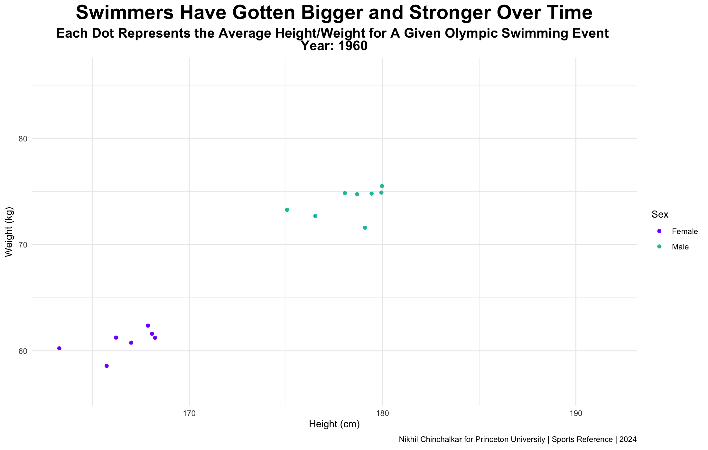

# Animated 3D Maps

We can build upon the concepts we used in the previous module to unlock the world of animation in 3D. This section relies on the template provided by [Carson Sievert](https://github.com/plotly/plotly.R/blob/master/demo/sf-plotly-3D-globe.R).

Our goal is to make this movie:

<figure><figcaption></figcaption></figure>

The data can be accessed from [here](https://www.gbif.org/dataset/00d636a3-e132-44b6-ae77-0b1cadb3e59e).

***

Let's load in our packages:

```r
library(plotly) #plotting the globe
library(dplyr) #wrangling the data
library(stars) #loading in the surfaces
library(tidyr) #cleaning the data
library(lubridate) #cleaning the dates
```

Like we did in Interactive 3D Maps, we'll define our degrees2radians function for convenience.

```r
degrees2radians <- function(degree) degree * pi / 180
```

Then, we'll read in our data.

```r
shearwaters <- read.csv("occurrence.csv")
```

<figure><figcaption></figcaption></figure>

There's 223 variables in this data frame, but we only need a few of them.

```r
shearwaters <- shearwaters[,names(shearwaters) %in% c("organismID", "verbatimEventDate", "decimalLatitude","decimalLongitude")]
```

<figure><figcaption></figcaption></figure>

Notice how certain rows of organismID have multiple values (separated by a semi colon). We need to split those up:

```r
shearwaters <- shearwaters |> 
  separate_rows(organismID, sep=";") |> 
  mutate(date = as.POSIXct(verbatimEventDate))
```

We're also making sure that R interprets the column verbatimEventDate as an actual Date.

<figure><figcaption></figcaption></figure>

Like we did last time, we can now create our mapping of 2D points to a 3D plane:

```r
shearwaters <- shearwaters |> 
  mutate(x=1.01 * cos(degrees2radians(decimalLongitude)) * cos(degrees2radians(decimalLatitude))) |> 
  mutate(y=1.01 * sin(degrees2radians(decimalLongitude)) * cos(degrees2radians(decimalLatitude))) |> 
  mutate(z=1.01 * sin(degrees2radians(decimalLatitude)))
```

<figure><figcaption></figcaption></figure>

This next part is a bit tricky. Since our data is precise to the minute, and is artibrarily tracked, it is unlikely for more than one organism to have its location known at the exact same time as another. This creates a problem for our plot, since for each frame, we can only show the data that is available at a given time, meaning we're probably going to just be showing one point per frame for our whole animation, which won't illustrate the idea that there's multiple organisms here.&#x20;

To solve this problem, we're going to try and log the location of every organism for every day:

<figure><figcaption></figcaption></figure>

Thus, for every point in time, we're going to display as many points as there are animals, even if there isn't necesarily data recorded for that specific day (we'll use data that is as close as possible to the actual day, so we'll only be using data from a few hours before or after).

We can get started on our data by first generating a list of all the unique date values.

```r
time_range <- seq(
  from = as.Date(min(shearwaters$date)),
  to = as.Date(max(shearwaters$date)),
  by = "day"
)
```

<figure><figcaption></figcaption></figure>

Then, we'll make a list of unique animals, to pair with our dates.

```r
animals <- unique(shearwaters$organismID)
```

<figure><figcaption></figcaption></figure>

Now, we'll make a data frame of all the combinations of animals and dates. This should match the style of the data frame on the right in the diagram above.

```r
full_times <- expand.grid(Animal = animals, Time = time_range)
```

<figure><figcaption></figcaption></figure>

We'll now add all the times and locations that were recorded for every animal, via a left join.

```r
shearwaters_full <- full_times |>
  left_join(shearwaters, by = c("Animal" = "organismID"))
```

<figure><figcaption></figcaption></figure>

Now that our data is all in the same place, we can work on formatting. Instead of having all the locations for each animal connected to each date, we can find the their location for the time closest to  the value in the Time column. We'll do this for each animal and for each date, and just add it to our call from above:

```r
shearwaters_full <- full_times |>
  left_join(shearwaters, by = c("Animal" = "organismID")) |> 
  group_by(Animal, Time) |> 
  filter(abs(difftime(Time, date, units = "secs")) == min(abs(difftime(Time, date, units = "secs")))) 
```

Here, we're just finding the row that corresponds to the date with the closest time (i.e. minimum difference) to the Time column.

<figure><figcaption></figcaption></figure>

Although we've got the right idea here, since some of the data is incomplete, we get some non-ideal results. Take, for instance, these rows:

<figure><figcaption></figcaption></figure>

While the code is correct, since there isn't any recorded data in the month of May, we're stuck with using data that is nearly a month too old or a month too new to represent each date. To prevent this from happening, we can modify our call to filter out differences in the Time and date column that are more than a day apart.&#x20;

```r
shearwaters_full <- full_times |>
  left_join(shearwaters, by = c("Animal" = "organismID"))|> 
  group_by(Animal, Time) |> 
  filter(abs(difftime(Time, date, units = "secs")) == min(abs(difftime(Time, date, units = "secs")))) |>
  filter(abs(difftime(Time, date, units = "days")) < 1)
```

We'll filter out any dates where there aren't more than 3 animals being tracked, so that we're not displaying frames where there's limited data. We're also going to filter the data to only include the winter and spring in 2010 (where we'll clearly see movement), as opposed to including frames from fall and winter 2009, where movement might not be as apparent.

```r
shearwaters_full <- full_times |>
  left_join(shearwaters, by = c("Animal" = "organismID"))|> 
  group_by(Animal, Time) |> 
  filter(abs(difftime(Time, date, units = "secs")) == min(abs(difftime(Time, date, units = "secs")))) |>
  filter(abs(difftime(Time, date, units = "days")) < 1) |> 
  ungroup() |>
  select(Animal, Time, date, decimalLatitude, decimalLongitude, x, y, z) |> 
  group_by(Time) |> 
  filter(n() > 3) |> 
  filter(Time >= as.Date("2010-01-01"))
```

<figure><figcaption></figcaption></figure>

Finally, plotly can only animated smoothly over characters, so after we've done all the manipulation to our dates, we can convert the Time column to a character column.

```r
shearwaters_full$Time <- as.character(shearwaters_full$Time)
```

The next steps should be familar. We're doing the same concepts as before:

```r
x_size <- 1000
y_size <- 500

empty_axis <- list(
  showgrid = FALSE, 
  zeroline = FALSE,
  showticklabels = FALSE,
  showspikes = FALSE,
  spikesides = FALSE,
  title = ""
)

lat <- seq(-90, 90, length.out = y_size)
lon <- seq(-180, 180, length.out = x_size)
lat <- matrix(rep(lat, x_size), nrow = y_size)
lon <- matrix(rep(lon, each = y_size), nrow = y_size)
```

Since the points are going to move around, we can't have a static camera, so we'll set up a simple camera path for our plot now.

```r
average_positions <- shearwaters_full |> 
  group_by(Time) |> 
  summarize(
    average_x = mean(x),
    average_y = mean(y),
    average_z = mean(z)
  )
```

Here, we're just finding the average positions for all of our points, which is the location where our camera should be placed. However, if we were to use these raw values for our camera movement, we would get a jerky animation, since the mean can change quite drastically between frames. To solve this issue, we can employ a smoothing spline to fit our data without causing too much camera movement frame-to-frame.

Here's an image to illustrate what I mean:

<figure><figcaption></figcaption></figure>

The smoothed line is in red, and the average X, Y, and Z are in black. As you can see, if we were to follow just the means, there would be too much camera movement as the line jumps up and down in all dimensions. However, following the spline, we get a much smoother animation, and our camera will move across the three dimensions easier.&#x20;

```r
spline_fit <- smooth.spline(average_positions$average_x, spar = .8)
camera_x_positions <- predict(spline_fit)$y
spline_fit <- smooth.spline(average_positions$average_y, spar = .8)
camera_y_positions <- predict(spline_fit)$y
spline_fit <- smooth.spline(average_positions$average_z, spar = .8)
camera_z_positions <- predict(spline_fit)$y
```

Above is the code to apply the splines. The first parameter provides the data we want to look at, and the spar is the strength of the smoothing.&#x20;

We're holding these positions in three separate lists, one for each dimension, and telling R we want to predict the y values for each of the corresponding variables.

Once that's done we can work on building some functions for plotting.

We're going to be using a moving background image to show the snow melting and the Earth heating up for summer. [Here](https://github.com/nikhilc52/animation\_links/tree/main/surfaces) you can view a list of 365 images that correspond to Earth's surface for the nth day of the year, which we'll use to change the surface over time.

```r
generate_surface <- function(file){
  raw_tif <- read_stars(paste0("surfaces/", file, ".png"), RasterIO = list(nBufXSize=x_size, nBufYSize=y_size))
  
  df_tif <- as.data.frame(raw_tif)
  df_tif <- df_tif |>
    mutate(x = x-180) |>
    mutate(y = y-90)
  
  red <- df_tif |> 
    filter(band == 1)
  names(red)[names(red) == paste0("X",file,".png")] <- 'red'
  red <- red[-3]
  
  green <- df_tif |> 
    filter(band == 2)
  names(green)[names(green) == paste0("X",file,".png")] <- 'green'
  green <- green[-3]
  
  blue <- df_tif |> 
    filter(band == 3)
  names(blue)[names(blue) == paste0("X",file,".png")] <- 'blue'
  blue <- blue[-3]
  
  rgb <- left_join(left_join(red, green),blue)
  rgb$color <- rgb(rgb$red/255,rgb$green/255,rgb$blue/255)
  rgb$color_int <- bitwShiftL(rgb$red, 16) + bitwShiftL(rgb$green, 8) + rgb$blue 
  
  rgb_earth <<- matrix(data=rgb$color_int, nrow=y_size, ncol = x_size, byrow=TRUE)
  
  earth_colorscale <- distinct(data.frame(rgb$color_int, rgb$color))
  earth_colorscale <- earth_colorscale |> arrange(rgb.color_int)
  
  while(nrow(earth_colorscale) > 255){
    toDelete <- seq(0, nrow(earth_colorscale), 2)
    earth_colorscale <- earth_colorscale[toDelete, ]
    rownames(earth_colorscale) = NULL
  }
  
  earth_colorscale$breaks <- seq(1:nrow(earth_colorscale))/nrow(earth_colorscale)
  earth_colorscale$breaks[1] = 0
  earth_colorscale <- earth_colorscale[,c(3,2)]
  names(earth_colorscale)[names(earth_colorscale) == 'rgb.color'] <- 'colors'
  earth_colorscale <<- earth_colorscale
}
```

As this function's name indicates, we're using this to generate the surface (satellite image) for each globe object. 90% of this function is the same as what we did in the previous section, with some minor tweaks to the red, green, and blue data frames that are needed to accomodate for the parameter. Note that we're setting rgb\_earth and earth\_colorscale as global variables using `<<-` so that they can be accessed outside of our function.

Next, we'll make a function for generating the globe:

```r
generate_globe <- function(curr_shearwaters, camera_index){
  globe <<- curr_shearwaters |>  
    plot_ly(height = 600) |> 
    add_sf(
      data = sf::st_as_sf(maps::map("world", plot = FALSE, fill = TRUE)), 
      x = ~ 1.001 * cos(degrees2radians(x)) * cos(degrees2radians(y)),
      y = ~ 1.001 * sin(degrees2radians(x)) * cos(degrees2radians(y)),
      z = ~ 1.001 * sin(degrees2radians(y)),
      color = I("black"), size = I(1),
      hoverinfo = "none"
    ) |> 
    add_trace(
      x=~curr_shearwaters$x,
      y=~curr_shearwaters$y,
      z=~curr_shearwaters$z,
      mode = "markers", type = "scatter3d",
      marker = list(size = 7),
      hoverinfo = "none"
    ) |> 
    add_surface(
      x = cos(degrees2radians(lon)) * cos(degrees2radians(lat)),
      y = sin(degrees2radians(lon)) * cos(degrees2radians(lat)),
      z = -sin(degrees2radians(lat)),
      surfacecolor = rgb_earth,
      colorscale=earth_colorscale,
      showscale = FALSE, hoverinfo = "none",
      lightposition = list(
        x=2,
        y=2,
        z=2
      ),
      contours = list(
        x = list(highlight = FALSE), 
        y = list(highlight = FALSE), 
        z = list(highlight = FALSE)
      )
    ) |> 
    layout(
      showlegend = FALSE,
      annotations=list(list(text=paste0("Day: ", dates[camera_index]),
                            showarrow=FALSE, font=list(family="Arial", size=28), y=0, bgcolor="white", opacity=0.85), 
                       list(text="<br><b>Greater Shearwater Migration</b>",font=list(family="Arial", size=48), bgcolor="white", opacity=0.85, y=.9)),
      scene = list(
        xaxis = empty_axis,
        yaxis = empty_axis,
        zaxis = empty_axis,
        aspectratio = list(x = 1, y = 1, z = 1),
        camera = list(eye=list(x=camera_x_positions[camera_index]*2,
                               y=camera_y_positions[camera_index],
                               z=camera_z_positions[camera_index]))
      )
    )
}
```

Again, this is 90% the same as the previous section, aside from some small changes to point aesthetics, title, and camera. For the title, note that we're creating it using an annotation so that we can make its background white. The same goes for the day counter, which is given a parameter that corresponds to the index value of the date we're plotting (`i` in the for loop). A similar structure is used to move the camera to the correct spot -  a parameter that corresponds to the appropriate place in the list. We're multiplying the X by 2 in order to move the camera back, else it would be too close to the earth's surface.

We're now ready to plot. We'll start by indicating how many frames we want, which is just the number of dates that we have available. Here, we're make a list of all the unique dates we have (the length of the list is the length of our animation).

```r
dates <- unique(shearwaters_full$Time)
```

We'll also initilize an image\_index variable to easily name our images in order.

```r
image_index <- 1
```

Before we start, we need to install orca, which is the package we'll be using to save the plotly files. This can be done by following the instructions on [GitHub](https://github.com/plotly/orca). After that, we need to install "processx" (but no need to call the library function), if we don't already have it.

```r
for(i in 1:length(dates)){
    print(paste("Date:",dates[i]))
    print(paste("Frame #:", image_index))
    
    file = formatC(yday(as.Date(dates[i])), width = 3, format = "d", flag = "0")
    generate_surface(file)
    
    curr_shearwaters <- shearwaters_full |> 
      filter(Time == dates[i])
    
    generate_globe(curr_shearwaters, i)
    
    orca(globe, paste0("image_sequence/",formatC(image_index, width = 3, format = "d", flag = "0"),".png"), width = 1400, height = 1400)
    image_index <- image_index + 1
  }
```

The for loop cycles through all the valid dates. The first part of our loop prints the current date and frame we're at so that we can keep track of our progress. Then, we get the file using yday, which calulates the what day number a given date is (2024-01-01 is 1, 2024-01-02 is 2, etc.) and fit that number to have 3 digits to match the name format of the png. We'll supply that file number to our generate\_surface function.

We then filter to get a data frame that only contains the animals for that specific date, and give that information, as well as the index number we're on, to the generate\_globe function, which will make our globe.&#x20;

Then, using orca, we'll render out our plot to a new folder, with 3 digits so that R can correctly order our frames, and increase the image\_index by 1.&#x20;

Running this for loop should take about 20 minutes.

&#x20;

Once we have our files properly rendered, we can turn our png sequence into a GIF. First, we'll load in the png files:

```r
png_files <- sort(list.files("image_sequence", pattern = "*.png", full.names = TRUE))
```

Then, we'll add a pause to the end of our gif by appending the last frame repeatedly:

```
for(i in 1:10){
  png_files <- append(png_files, png_files[length(png_files)])
}
```

```
gifski::gifski(png_files, gif_file = "final.gif", width = 1400, height = 1400, delay = 30/length(png_files))
```

Make sure to match the width and height of the gif with the width and height of the png files (which we defined when calling orca in the for loop). The delay being 30/length(png\_files) ensures that our animation takes 30 seconds.

That's all! We've now made a movie tracking animal migration patters exclusively in R.


[Click here to view the raw file used to make this plot.](../appendix/advanced-animations/animated-3d-maps.r.md)

