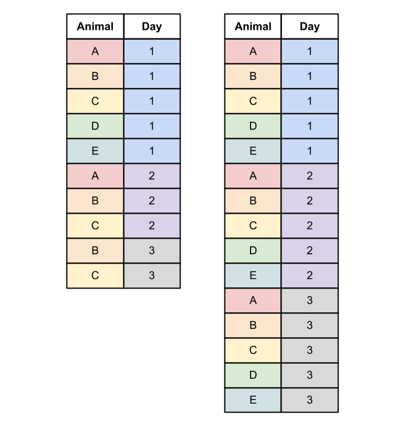

# Animated Heat Maps

The NBA and other sports leagues are full of interesting data and trends. We can visualize how professional basketball has changed with heatmaps that track shot location.

The animation we make will look like this:

<figure><figcaption></figcaption></figure>

The dataset is available for download [here](https://drive.google.com/file/d/1\_7YIYr4kasLzHMTQzyaQ9-lMUrK6n5Dm/view), and it is originally from [GitHub](https://github.com/DomSamangy/NBA\_Shots\_04\_24?tab=readme-ov-file).

***

As always, let's load in our libraries.

```r
library(tidyverse) #used to get the data
library(dplyr) #used to wrangle the data
library(gganimate) #used to animate the plot
library(ggplot2) #used to make the plot
```

Before we get started, we need to load in some functions in advance, so that we can call them when we plot. These were taken directly from the author of the data, with slight modifications to make it a bit easier to understand.

```r
####plotting the court#####
width = 50
height = 94 / 2
key_height = 19
inner_key_width = 12
outer_key_width = 16
backboard_width = 6
backboard_offset = 4
neck_length = 0.5
hoop_radius = 0.75
hoop_center_y = backboard_offset + neck_length + hoop_radius
three_point_radius = 23.75
three_point_side_radius = 22
three_point_side_height = 14

circle_points = function(center = c(0, 0), radius = 1, npoints = 360) {
  angles = seq(0, 2 * pi, length.out = npoints)
  return(data_frame(x = center[1] + radius * cos(angles),
                    y = center[2] + radius * sin(angles)))
}

plot_court = function() {
  court_points = data_frame(
    x = c(width / 2, width / 2, -width / 2, -width / 2, width / 2),
    y = c(height, 0, 0, height, height),
    desc = "perimeter"
  )
  
  court_points = bind_rows(court_points , data_frame(
    x = c(outer_key_width / 2, outer_key_width / 2, -outer_key_width / 2, -outer_key_width / 2),
    y = c(0, key_height, key_height, 0),
    desc = "outer_key"
  ))
  
  court_points = bind_rows(court_points , data_frame(
    x = c(-backboard_width / 2, backboard_width / 2),
    y = c(backboard_offset, backboard_offset),
    desc = "backboard"
  ))
  
  court_points = bind_rows(court_points , data_frame(
    x = c(0, 0), y = c(backboard_offset, backboard_offset + neck_length), desc = "neck"
  ))
  
  foul_circle = circle_points(center = c(0, key_height), radius = inner_key_width / 2)
  
  foul_circle_top = filter(foul_circle, y > key_height) %>%
    mutate(desc = "foul_circle_top")
  
  foul_circle_bottom = filter(foul_circle, y < key_height) %>%
    mutate(
      angle = atan((y - key_height) / x) * 180 / pi,
      angle_group = floor((angle - 5.625) / 11.25),
      desc = paste0("foul_circle_bottom_", angle_group)
    ) %>%
    filter(angle_group %% 2 == 0) %>%
    select(x, y, desc)
  
  hoop = circle_points(center = c(0, hoop_center_y), radius = hoop_radius) %>%
    mutate(desc = "hoop")
  
  restricted = circle_points(center = c(0, hoop_center_y), radius = 4) %>%
    filter(y >= hoop_center_y) %>%
    mutate(desc = "restricted")
  
  three_point_circle = circle_points(center = c(0, hoop_center_y), radius = three_point_radius) %>%
    filter(y >= three_point_side_height, y >= hoop_center_y)
  
  three_point_line = data_frame(
    x = c(three_point_side_radius, three_point_side_radius, three_point_circle$x, -three_point_side_radius, -three_point_side_radius),
    y = c(0, three_point_side_height, three_point_circle$y, three_point_side_height, 0),
    desc = "three_point_line"
  )
  
  court_points = bind_rows(
    court_points,
    foul_circle_top,
    foul_circle_bottom,
    hoop,
    restricted,
    three_point_line
  )
  
  court_points <- court_points
  
  ggplot() +
    geom_path(
      data = court_points,
      aes(x = x, y = y, group = desc),
      color = "black", sizes = 2
    ) +
    coord_fixed(ylim = c(0, 45), xlim = c(-25, 25)) +
    theme_minimal(base_size = 22) +
    theme(
      text = element_text(color = "black"),
      plot.background = element_rect(fill = 'gray15', color = 'gray15'),
      panel.background = element_rect(fill = "white", color = "white"),
      panel.grid = element_blank(),
      panel.border = element_blank(),
      axis.text = element_blank(),
      axis.title = element_blank(),
      axis.ticks = element_blank(),
      legend.background = element_rect(fill = "white", color = "white"),
      legend.margin = margin(-1, 0, 0, 0, unit = "lines"),
      legend.position = "bottom",
      legend.key = element_blank(),
      legend.text = element_text(size = rel(1.0))
    )
}
```

There's no need to try and decipher all of that, just know that it plots the background lines for our court and that we call it with `plot_court()`.

```
plot_court()
```

<figure><figcaption></figcaption></figure>

I recommend that you paste this chunk of code into your workspace, run it, then minimize it by clicking the downward arrow on whatever line number the comment `####plotting the court####` is. This is so that the functions are within the R memory.

Let's now get started with the data.

```r
shots <- read_csv("nba_shots.csv")
```

<figure><figcaption></figcaption></figure>

Once we have all the shots, we can filter them based on location. We only want shots that are within half-court, so we'll only take those whose LOC\_Y is below 40.

```r
shots_plot <- shots |> 
  filter(LOC_Y<=40)
```

For simplicity and to allow the plot to look good, let's round each LOC\_X and LOC\_Y location to the next lowest integer. This is effectively making "bins" for our data to be grouped into, which makes the heatmap look more readable (and easier to render - there's less points to plot). Without this, each shot location would be tiny points instead of easy-to-read large squares.

```r
shots_plot$LOC_X <- as.integer(shots_plot$LOC_X)
shots_plot$LOC_Y <- as.integer(shots_plot$LOC_Y)
shots_plot$SEASON_1 <- as.integer(shots_plot$SEASON_1)
```

We'll also make the `SEASON_1` column integers, so that it can be properly read by `gganimate`.

Now that the data has the right class, we can group each shot by its location (both `LOC_X` and `LOC_Y`) and the season it was shot. Then, we count how many shots were taken at the location in that season.

```r
shots_plot <- shots_plot |> 
  group_by(LOC_X, LOC_Y, SEASON_1) |> 
  summarize(
    Count = n()
  )
```

<figure><figcaption></figcaption></figure>

Nice. Now we're on to the plot. Let's start with a static version. Note that we call `plot_court()` first, since it creates the background which we'll plot over.

```r
plot_court() +
  geom_tile(data=shots_plot, aes(x=LOC_X, y=LOC_Y, fill=Count, group=interaction(LOC_Y, LOC_X)), alpha=0.8)
```

`geom_tile` is a heatmap syntax in ggplot, which makes a tile at each given location. In this case, its making a tile at each `LOC_X` and `LOC_Y` for each shot. The `fill=Count` tells R that we want the tiles to be filled according to how many shots were taken at that location. The `group=interaction(LOC_Y, LOC_X)` is a bit tricky to understand, but it essentially means that every group/tile is a unique shot with a unique `LOC_X` and `LOC_Y`. Finally, the `alpha` of `0.8` is given to make the background court visible behind our data.

<figure><figcaption></figcaption></figure>

This doesn't look too promising, but don't worry, we're on the right track. To fix it, we can enhance some aspects of our plot, including the legend, gradient, titles, and theme. Note that we're using a `log2` scale, so that layups (close shots near the basket) don't skew the data.

The `scale_fill_gradient2` line is important, since it sets the color scheme we'll be using. While the colors are self-explanatory, it should be noted that since we're using a `log2` scale, the `midpoint` must take that into account. That is, the `midpoint` of `6` really means 2 to the 6th power (i.e. the midpoint is 256).&#x20;

The `coord_fixed(ratio=1)` line just makes sure that are squares remain squares: each coordinate should have an equal size height and width (the ratio between height and width should be `1`).&#x20;

```r
plot_court() +
  geom_tile(data=shots_plot, aes(x=LOC_X, y=LOC_Y, fill=Count, group=interaction(LOC_Y, LOC_X)), alpha=0.8)+
  scale_fill_gradient2(low = "white", mid="white",high = "red", trans="log2", midpoint = 6)+
  coord_fixed(ratio=1)+
  theme_void()+
  labs(title = "NBA Shots Heatmap: Switch from Mid-range to 3-pointers",
       fill="# of Shots")+
  theme(plot.title = ggtext::element_markdown(size=16, hjust=0.5, face="bold"),
        plot.subtitle = ggtext::element_markdown(size=14, hjust=0.5, face="bold"))
```

<figure><figcaption></figcaption></figure>

We're now ready to animate. Again, we're going to use `transition_time` for our animation, cycling over the year of the season. The new range synatax is way of avoiding using as.integer in our subtitle. All it does is tell R that our animation is using integers (`L`) from 2004 to 2024.&#x20;

Since we're doing this, we can just use `{frame_time}` in our plot, without any class conversions.&#x20;

```r
plot_court() +
  geom_tile(data=shots_plot, aes(x=LOC_X, y=LOC_Y, fill=Count, group=interaction(LOC_Y, LOC_X)), alpha=0.8)+
  scale_fill_gradient2(low = "white", mid="white",high = "red", trans="log2", midpoint = 6)+
  coord_fixed(ratio=1)+
  theme_void()+
  labs(subtitle = "Year: {frame_time}", #changed line
       title = "NBA Shots Heatmap: Switch from Mid-range to 3-pointers",
       fill="# of Shots")+
  theme(plot.title = ggtext::element_markdown(size=16, hjust=0.5, face="bold"),
        plot.subtitle = ggtext::element_markdown(size=14, hjust=0.5, face="bold"))+
  transition_time(SEASON_1, range=c(2004L, 2024L)) #added line
```

That's it for the animation! Now we just feed it into an object, and animate that object with some simple specifications.

```
animation <- plot_court()+
    #continued from above
```

```
animate(animation, fps = 10, duration = 26, end_pause = 50, height = 7,
        width = 7, units = "in", res = 200)
```


[Click here to view the raw file used to make this animation.](../appendix/advanced-animations/animated-heat-map.r.md)

