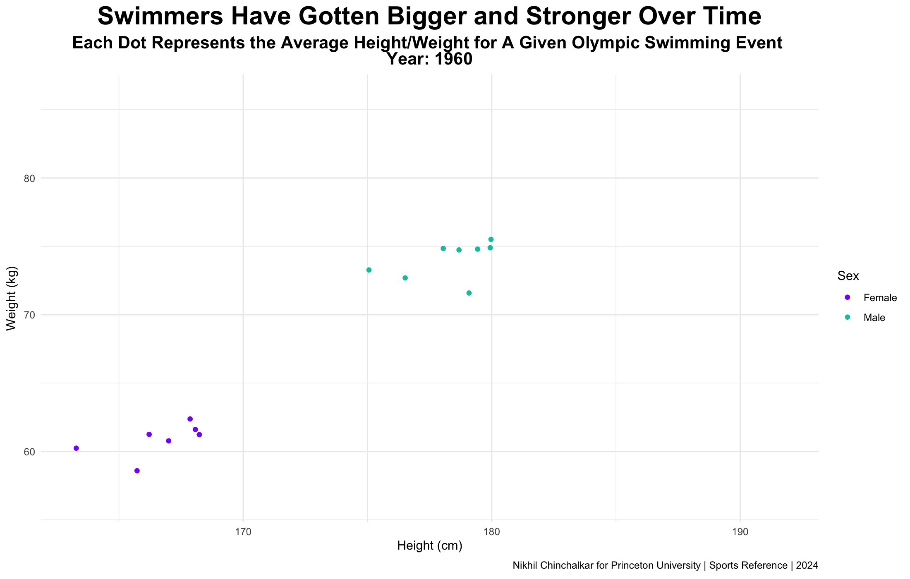
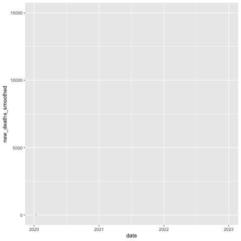

# Animated Line Graphs

COVID-19 data is somewhat of a standard for modern data sources, since the pandemic was relatively recent and much of the data was publicly available. We can elevate the presentation of this data with animated graphs that reveal information as time passes, and manipulate the speed of certain points in time.

At the end of this chapter, we'll have made this plot:

<figure><figcaption></figcaption></figure>

The data can be obtained from [here](https://ourworldindata.org/covid-cases) (Download the complete _Our World in Data_ COVID-19 dataset).

***

Like usual, we'll load in our packages.

```r
library(ggplot2) #to plot the data
library(gganimate) #to animate the data
library(dplyr) #to wrangle the data
```

We'll now import the data, with the `read_excel` function, since our data is in xlsx form.

```r
covid <- readxl::read_excel("covid.xlsx") #requires 'readxl' is installed
```

<figure><figcaption></figcaption></figure>

Since we're going to be working with dates, we need to convert the date column to `Date` objects.

```r
covid$date <- as.Date(covid$date)
```

Now, with the data formatted, we can simplify the dataframe to make it easier to represent.

```r
world <- covid |> 
  filter(location=="World") |> 
  filter(!is.na(total_cases)) |> 
  filter(date < "2023-01-01") |> 
  select(date, new_deaths_smoothed)
```

Essentially, we're filtering to only look at world-wide cases (rather than on a country-by-country basis), making sure the data is available, and restricting our data to 2022 or earlier, where the majority of the concentration of deaths will be. Finally, we select only the data that we need, to make our data frame easier to work with.

<figure><figcaption></figcaption></figure>

With our data frame in place, we can start to add the annotations, which is the most difficult part of making this plot. Each annotation has the text (i.e. the words that are displayed on screen) and the date (i.e. where and when the text should be displayed). The combination of this data can best be represented by a 'dictionary'-esque data frame.&#x20;

We'll initialize it with:

```r
annotations <- data.frame(keys=list(), values=list())
```

Then add our data with some simple calls:

```r
annotations <- data.frame(keys='First U.S. Death', values='2020-02-06')
annotations <- add_row(annotations, keys='CDC Mask Recommendation', values='2020-04-03')
annotations <- add_row(annotations, keys='Vaccines Released in the U.S.', values='2020-12-14')
annotations <- add_row(annotations, keys='FDA Authorizes Booster Shots', values='2021-11-19')
annotations <- add_row(annotations, keys='WHO Declares Omicron Variant of Concern', values='2021-11-26')
```

<figure><figcaption></figcaption></figure>

With the annotations dictionary filled, we'll now go back to our world data frame to enable our "bullet effect" that slows down the animation at certain points. It's easiest to do this with a simple function.

```r
bullet_effect <- function(dates_to_slow, strength){
  world$show_time = case_when(world$date %in% dates_to_slow ~ strength, TRUE~1)
  world$reveal_time = cumsum(world$show_time)
  return(world)
}
```

Essentially, this function takes in a list of `dates_to_slow`, and the strength (how much will the plot be slowed at each point - higher is longer). We then add a column to our data frame that quantifies how long each date should be shown: if the date is to be slowed, then the length should be the strength that we provide, else, it should just be one.&#x20;

Then, we make a new column with the cumulative sum of the `show_time` column. This is the column that we will provide to the `transition_reveal` call later.&#x20;

Since `transition_reveal` is a continuous animation function, it must go through all the values in the `reveal_time` column. That means that if the `reveal_time` suddenly jumps up from 1 to 101, say (if show time is 100 for a row), then the plot would have to go through 1 to 101 for that date, slowing down in the process.&#x20;

```r
world <- bullet_effect(annotations$values, 100)
```

We'll use the `bullet_effect` function we just defined to add to our world data frame with a strength of 100, which I find is good for this specific plot. We're supplying the values of the annotation dictionary, which corresponds to a list of dates, which is exactly what we need (`dates_to_slow`).

<figure><figcaption></figcaption></figure>

We're now going to move on to plotting the annotations, starting with finding an appropriate Y-value for the text and lines, so that we can minimize overlaps. We can do this with another function.

```r
ylimit <- 15000 #upper y_lim
```

```r
find_y_value <- function(data_value, y_lim, index){
  if(index %% 2 == 1){
    y_value = ifelse(data_value + y_lim/5 < y_lim, data_value + y_lim/5, data_value - y_lim/5)
  }
  else{
    y_value = ifelse(data_value - y_lim/5 > 1000, data_value - y_lim/5, data_value + y_lim/5)
  }
  return(y_value)
}
```

This function takes in a data\_value, which corresponds to the number of new deaths (smoothed) for a given date, the upper limit for the Y axis on our plot, and the index of our annotation (i.e. what number annotation it is).&#x20;

If the annotation number is odd, then we'll start by trying to put the annotation above the line. We check if it is valid by seeing if the `data_value` plus the vertical offset (as y\_lim/5) will still fit within the plot. If it is, then we use that as our Y value. If not, then we put the annotation below by the same vertical offset.

To try and minimize overlaps in the simplest way possible, we repeat the same process (but inverted) for annotation numbers that are even. Note that the "> 1000" is just so that we don't have annotations that are covering the X-axis. Together, these two conditionals make it such that if we had two annotations with close enough dates, they wouldn't overlap since one would be on top and the other on the bottom.

Now that we can calculate the y\_value of any given annotation, we can work on actually generating them. We'll start by defining two functions that we're going to call for every frame in our animation.

```r
plot_text_annotation <- function(){
  text_list <- geom_label(y=0,x=0,label="")
  for(i in 1:length(annotations$values)){
    y_value <- find_y_value(world$new_deaths_smoothed[world$date==as.Date(annotations$values[i])], ylimit, i)
    
    text_list <- c(text_list,geom_label(label=as.character(annotations$keys[i]),
                                        color=scales::alpha('black',ifelse(world$date>=as.Date(annotations$values[i]), 1, 0)),
                                        x=as.Date(annotations$values[i]),
                                        y=y_value,
                                        fill = alpha(c("white"),ifelse(world$date>=as.Date(annotations$values[i]), 1, 0))))
  }
  return(text_list)
}
```

This function is what we'll use to plot each of the texts. We start by initializing a list of `geom_label` objects, the first of which is empty. Then, for every value to be displayed, we cycle through and find the appropriate `y_value`, calling the function we just defined. While seemingly daunting at first, the first parameter we supply is just the number of deaths for the current date we're looking to plot. Next, we give the `ylimit` we defined earlier, and the index value of this annotation, `i`.

After we've found the `y_value`, we then append to our list a `geom_label` object. The label has our annotation for the given `i` value, and we're using `scales::alpha` (since `geom_labels` can't directly modify the alpha value of a color). The color alpha value changes based on the current date being displayed: if the date displayed is after (or on) the date that the current annotation corresponds to, then we should have the alpha equal to 1. Otherwise, it would be 0. This same concept is repeated for the fill color of the background of each label, to have the background match the animation of the text.

The X value should be the date of the annotation, so that it is placed directly above or below the corresponding point on the line.

Essentially, this function, after implementation, will plot all the annotations for each frame, and change the alpha value to reveal the annotations at their respective dates.

We can now mirror this function for the line segment connecting the annotation to the line.

```r
plot_segment_annotation <- function(){
  segment_list <- geom_segment(y=0,x=0,xend=0,yend=0)
  for(i in 1:length(annotations$values)){
    y_value <- find_y_value(world$new_deaths_smoothed[world$date==as.Date(annotations$values[i])], ylimit, i)
    segment_list <- c(segment_list, geom_segment(xend=as.Date(annotations$values[i]),
                 yend=world$new_deaths_smoothed[world$date==as.Date(annotations$values[i])],
                 x=as.Date(annotations$values[i]),y=y_value,
                 alpha=ifelse(world$date>=as.Date(annotations$values[i]), 1, 0),
                 linetype="dashed"))
  }
  return(segment_list)
}
```

Aside from some minor changes to syntax, the bulk of this function is the same as the above. The one important change is the `yend` being set to the value of the line, meaning the line is drawn up or down from the line to the annotation.

With these functions now defined, we can move on to actually generating the plot.

```r
world |> 
  ggplot(aes(x=date, y=new_deaths_smoothed))+
  ylim(0,ylimit)+
  plot_segment_annotation()+
  geom_line()+
  plot_text_annotation()+
  transition_reveal(reveal_time)
```

We're doing some basic setups for the plot, with the ylim defined by the number we set earlier. Note the order in which our functions are called. We're putting the line segment on the back-most layer, the `geom_line` in the middle, and then the `geom_label` for our annotations on top. Since we're using `transition_reveal`, our functions are called for every frame.

<figure><figcaption></figcaption></figure>

The major elements are in place, but our plot doesn't look too nice. We'll pretty it up and then save it.

```r
animation <- world |> 
  ggplot(aes(x=date, y=new_deaths_smoothed))+
  theme_minimal()+ #added line
  labs(title="New COVID-19 Worldwide Deaths", 
       subtitle="{world$date[min(which(world$reveal_time >= floor(frame_along)))]}")+
  xlab('Date')+#added line
  ylab('New Deaths Per Week')+ #added line
  theme(plot.title = ggtext::element_markdown(size = 22, hjust =0.5, face = "bold"), 
        plot.subtitle = ggtext::element_markdown(size = 10, hjust =0.5, face = "bold"),
        axis.text.x=element_text(size=10))+ #added line
  ylim(0,ylimit)+
  plot_segment_annotation()+
  geom_line()+
  plot_text_annotation()+
  scale_alpha(guide='none')+ #added line
  transition_reveal(reveal_time)
```

Though the subtitle looks a little complicated, all it does is calculates the lowest index where the reveal time (`frame_along`) is less than or equal to the reveal time in our data frame, world, and returns the date for that current time. This concept just ensures that the date is properly displayed during pauses. Take, for instance:

<figure><figcaption></figcaption></figure>

As the frame\_along goes from 32 to 132, it will reach, say, 35. The formula we used for our subtitle will find all the rows where the `reveal_time` column is greater than or equal to the frame\_along (i.e. rows 33, 34, 35, ...). Then, we'll choose the lowest value of the bunch (33) and return the date that corresponds to that row (2020-02-06), which is the date we're currently slowing.&#x20;

We'll now animate this with the animate function, with some appropriate parameters.

```r
animate(animation, fps = 15, duration = 30, end_pause=75, height = 7,
        width = 9, units = "in", res = 200)
```

That's all! We've now made a nice line graph that automatically places and slows annotations where we want.


[Click here to view the raw file used to make this animation.](../appendix/advanced-animations/animated-line-graph.r.md)

