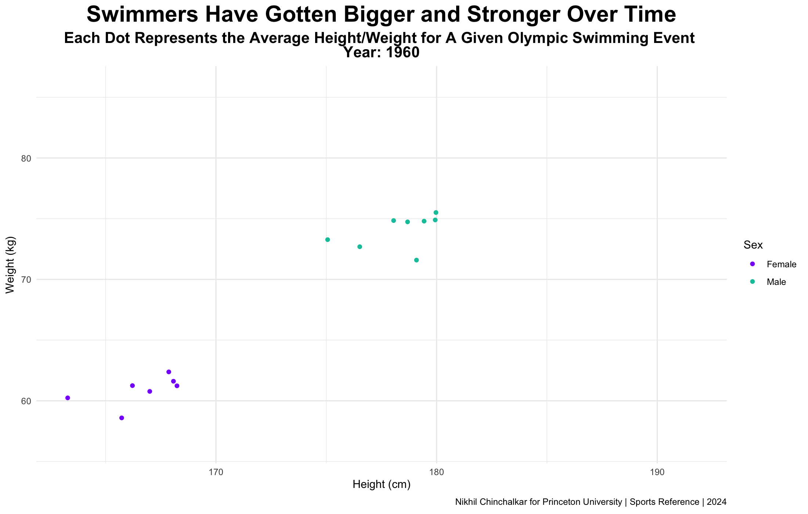

# Animated Scatter Plots

Are athletes actually getting bigger, faster, and stronger? We can look at the heights and weights of hundreds of thousands of Olympic athletes to find out.

Our goal is to make this plot:

<figure><figcaption></figcaption></figure>

The dataset we'll use is available to download [here](https://www.kaggle.com/datasets/heesoo37/120-years-of-olympic-history-athletes-and-results?select=athlete\_events.csv).

***

As always, we start by loading the libraries.

```r
library(ggplot2) #for plotting
library(gganimate) #for animating the plot
library(dplyr) #for data wrangling
library(tidyverse) #for loading data
```

Let's load in the csv.

```r
athletes <- read_csv("athletes.csv")
```

<figure><figcaption></figcaption></figure>

We're going to need to do some cleaning if we want to have a single height and weight for swimming event in every Olympic year. We can easily do this cleaning with a few lines.&#x20;

First, we'll filter out athletes without given heights and weights and any non-swimming events. Then, we'll group together every athelete under their event, year, and sex. Finally, we'll only select Olympic games past 1960, since before this year, the data is very limited.

```r
height_weight <- athletes |> 
  filter(!is.na(Height)) |> 
  filter(!is.na(Weight)) |> 
  filter(Sport == "Swimming") |> 
  group_by(Year, Event, Sex) |> 
  summarize(
    Height = mean(Height),
    Weight = mean(Weight),
    Athlete_Count = n(),
    Sport = first(Sport)
  ) |> 
  filter(Year >= 1960)
```

<figure><figcaption></figcaption></figure>

Perfect. We're now ready to plot. We'll start with a static one for reference, before we go into animation.

```
height_weight |> 
  ggplot()+
  geom_point(aes(x=Height, y=Weight, color=Sex, group=Event))
```

<figure><figcaption></figcaption></figure>

Let's make this look a little better.

```r
height_weight |> 
  ggplot()+
  geom_point(aes(x=Height, y=Weight, color=Sex, group=Event))+
  labs(title="Swimmers Have Gotten Bigger and Stronger Over Time", 
       subtitle="Each Dot Represents the Average Height/Weight for A Given Olympic Swimming Event",
       caption="Nikhil Chinchalkar for Princeton University | Sports Reference | 2024")+
  scale_color_manual(breaks=c("F","M"), labels=c("Female","Male"),
                     values=c("#8700f9", "#00c4aa"))+
  theme_minimal()+
  xlab("Height (cm)")+
  ylab("Weight (kg)")+
  theme(plot.title = ggtext::element_markdown(size = 22, hjust =0.5, face = "bold"), 
        plot.subtitle = ggtext::element_markdown(size = 15, hjust =0.5, face = "bold"))
```

<figure><figcaption></figcaption></figure>

Nice - we can start working on our animation now. Since the Olympics only happen once every four years, transition\_time isn't the best option here. If we used transition\_time, 3/4 of the time would be spent in the transition period, which isn't ideal.

Instead, we'll use transition\_states to better control the transition options.&#x20;

```r
+transition_states(Year, wrap=FALSE, transition_length = 1, state_length = 1)
```

`Year` indicates to R that we're transitioning by year. The `wrap=FALSE` means that the last state will not transition into the first. This is exactly what we want - time should only go forward within our animation, so having a transition between 2014 to 1960 doesn't make sense. `transition_length` and `state_length` are the relative lengths of the transition and non-transition periods (i.e. non-Olympic years and Olympic years). To better balance our plot, we're setting both of these to be equal.

If we run this code as is, we're going to get point movement that is linear.  While linear movement isn't bad, it could be better. Let's use this syntax to change the point movement to a smoother cubic function.

```r
+ease_aes("cubic-in-out")
```

This tells R to ease the transition both in and out of states using a cubic function. The change is slight but noticable. On the left is the default animation, on the right is cubic in and out.

<div>

<figure><figcaption><p>Linear</p></figcaption></figure>

 

<figure><figcaption><p>Cubic</p></figcaption></figure>

</div>

We can now add a trail of points to better illustrate the change, rather than rely on the viewers' memory to remember the starting point. This is easily done with the shadow\_trail function, which does exactly what it sounds like: adding a shadow trail of points. We can specify the alpha level of the shadow as a parameter.

```r
+shadow_trail(alpha=0.1)
```

With the trail in place, we can label our graph with a subtitle, using `{next_state}`, to show the state we're going to during transition periods and the current state during non-transition periods.

```
height_weight |> 
  ggplot()+
  geom_point(aes(x=Height, y=Weight, color=Sex, group=Event))+
  labs(title="Swimmers Have Gotten Bigger and Stronger Over Time", 
       subtitle="Each Dot Represents the Average Height/Weight for A Given Olympic Swimming Event
       <br>Year: {next_state}")+
  scale_color_manual(breaks=c("F","M"), labels=c("Female","Male"),
                     values=c("#8700f9", "#00c4aa"))+
  theme_minimal()+
  xlab("Height (cm)")+
  ylab("Weight (kg)")+
  theme(plot.title = ggtext::element_markdown(size = 22, hjust =0.5, face = "bold"), 
        plot.subtitle = ggtext::element_markdown(size = 15, hjust =0.5, face = "bold"))+
  transition_states(Year, wrap=FALSE, transition_length = 1, state_length = 1)+
  ease_aes("cubic-in-out")+
  shadow_trail(alpha=0.1)
```

Finally, we can put our plot into an animation object, and animate.

```
animation <- height_weight |>
    ggplot()+
    #continued from above
```

```
animate(animation, fps=10, duration=18, end_pause=30, height = 7,
        width = 11, units = "in", res = 200)
```

For `transition_stages`, it's good practice to have a specified number of frames for each stage, otherwise the animation might be a bit choppy. In our case, we have 15 Olypmic games, at 10 FPS, meaning we want 150 frames for the transitions. A 30 frame end pause means we need 30 extra frames at the end to still have 150 frames for transitions, meaning we need 180 frames or 18 seconds for the animation.

Here's that explained visually:

<figure><figcaption></figcaption></figure>

If we didn't have an integer value for the number of frames per stage/Olypmic games, we'd end up with an animation that isn't quite as visually appealing, as rounding on the backend of R messes up the precsion of each frame.

Note that this type of math is present in all the types of animations (like `transition_time` or `transition_reveal`), but just much less noticeable (as the number of states is a lot higher), so its not a necessity to figure it out. For `transition_states`, though, its best if you do.


[Click here to view the raw file used to make this animation.](../appendix/advanced-animations/animated-scatter-plot.r.md)

