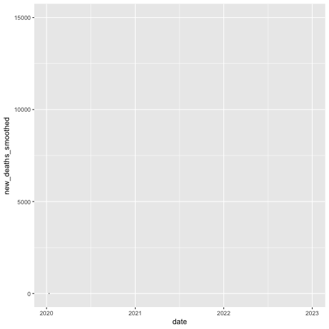

# Animated Surface Maps

The Earth's surface temperature has changed significantly since the 20th century. One way to visualize these changes is through a map of all the countries and their respective temperature differences.

In this section, we'll be making this plot:

<figure><figcaption></figcaption></figure>

The data is accessible [here](https://www.kaggle.com/datasets/berkeleyearth/climate-change-earth-surface-temperature-data?select=GlobalLandTemperaturesByCountry.csv) (GlobalLandTemperaturesByCountry.csv**)**.

***

As usual, we'll load in our libraries first.

```
library(tidyverse) #getting the data
library(gganimate) #animating the plot
library(ggplot2) #generating the plot
library(sf) #converting the data to plottable objects
library(rnaturalearth) #loading the background map
```

We'll now load in a map of the world. Perviously, we did this with the `maps` package, but I'm now using `rnaturalearth`. There's no big difference between the two for this type of plot, so we'll explore the other option for now.

```r
world <- ne_countries(scale = "medium", returnclass = "sf")
```

<figure><figcaption></figcaption></figure>

We'll also read in our data.

```r
temperatures <- read_csv("temperatures.csv")
```

<figure><figcaption></figcaption></figure>

When we eventually plot, we need to join together the two datasets. Unfortunately, some of the names of countries are not equal between the two datasets, so we'll need to manually adjust those now.

```r
temperatures$Country[which(temperatures$Country == "United States")] <- "United States of America"
temperatures$Country[which(temperatures$Country == "Tanzania")] <- "United Republic of Tanzania"
temperatures$Country[which(temperatures$Country == "Congo (Democratic Republic Of The)")] <- "Democratic Republic of the Congo"
temperatures$Country[which(temperatures$Country == "Congo")] <- "Republic of the Congo"
temperatures$Country[which(temperatures$Country == "Côte D'Ivoire")] <- "Ivory Coast"
```

Now that we've adjusted, we can do a left join on the world data frame, which contains the geometry.

```
world_temperatures <- left_join(world, temperatures, by=c("admin"="Country"))
```

Since we're going to be iterating over dates, we need to make sure that R interprets the date column as `Date` objects.

```
world_temperatures$dt <- as.Date(world_temperatures$dt)
```

With our data in the proper format, we can now filter it down.

```
world_plot <- world_temperatures |> 
  mutate(year = as.integer(format(dt, '%Y'))) |>
  filter(year > 1984) |> 
  select(admin, AverageTemperature, year)
```

<figure><figcaption></figcaption></figure>

In this code segment, we're just making a new column for the year of every data point, and filtering to the years 1985 and greater. Then, to make the data easier to handle, we're only selecting the three most important columns, which we'll soon use in our plot.

Since we're comparing each year's surface temperature with the 20th century average (for each country), we need to obtain that data.

```r
average_20th <- temperatures |> 
  mutate(year = as.integer(format(dt, '%Y'))) |> 
  filter(year > 1900) |> 
  filter(year < 2001) |> 
  group_by(Country) |> 
  summarize(
    average_20th=mean(AverageTemperature)
  )
```

<figure><figcaption></figcaption></figure>

We're doing a very similar manipulation of the data here, making a new column for the year, then filtering to only include 20th century values. After that, we group by every country, then find the average surface temperature in the 20th century for that country.&#x20;

With this in place, we can then join `average_20th` back with the `world_plot` data, to have all the data in one place.

```r
world_plot <- left_join(world_plot, average_20th, by=c("admin"="Country"))
```

<figure><figcaption></figcaption></figure>

The data is still in need of some cleaning though. We need to have just one value for each year, not 12 (for all the months).

```r
world_plot <- world_plot |>
  filter(!is.na(AverageTemperature)) |> 
  group_by(admin, year) |> 
  summarize(
    average_20th = first(average_20th),
    AverageTemperatureYear=mean(AverageTemperature),
    geometry=first(geometry),
    difference = AverageTemperatureYear-average_20th
  )
```

We're just filtering for actual values, then grouping by country and year, and formatting the data accordingly. We're taking the first value for all the columns where the data doesn't change, and the mean for the average temperature (which changes per month). Then, we find the difference between the average temperature of that year and the average 20th century value.

After that, we'll have a data frame with each country, the year, the surface temperature for that year, and the 20th century average.

<figure><figcaption></figcaption></figure>

We're now ready to plot.

```r
ggplot(world_plot)+
  geom_sf(aes(fill=difference))+
  transition_time(year, range=c(1985L,2013L))
```

With this basic structure, we're supplying our `world_plot` data frame to the `ggplot` object, then accessing the difference column to fill each country. Finally, we're transitioning through time for the years 1985 through 2013, so we give the range (as an integer) as well as the year variable to the `transition_time` method.

After a few minutes, you'll get this plot:

<figure><figcaption></figcaption></figure>

We have all the data in the right place, but we can make this look better.

```r
animation <- ggplot(world_plot)+
  geom_sf(aes(fill=difference))+
  transition_time(year, range=c(1985L,2013L))+
  scale_fill_gradient2(low = "blue", mid = "white", high = "red", midpoint = 0) + #added line
  theme_minimal()+ #added line
  labs(title="Difference in Surface Temperatures from 20th Century Average", 
       subtitle="Date: {frame_time}",
       fill="Difference from 20th Century Average (C)")+ #added line
  xlab('')+ #added line
  ylab('')+ #added line
  theme(plot.title = ggtext::element_markdown(size = 21, hjust =0.5, face = "bold"), 
        plot.subtitle = ggtext::element_markdown(size = 10, hjust =0.5, face = "bold"),
        legend.position = "bottom")+ #added line
  transition_time(year, range=c(1985L,2013L))
```

Note that we're using frame\_time in the subtitle, but since we indicated in transition\_time that we're iterating over integers, we don't need to do any casting.

We then supply this animation to the animate function, which yeilds our final plot.

```r
animate(animation, fps=5, duration=30, height = 7, end_pause=25,
        width = 9, units = "in", res = 200)
```

We're finished! We've now made a very clear and insightful plot of animated surfaces.


[Click here to view the raw file used to make this animation.](../appendix/advanced-animations/animated-line-graph.r.md)

