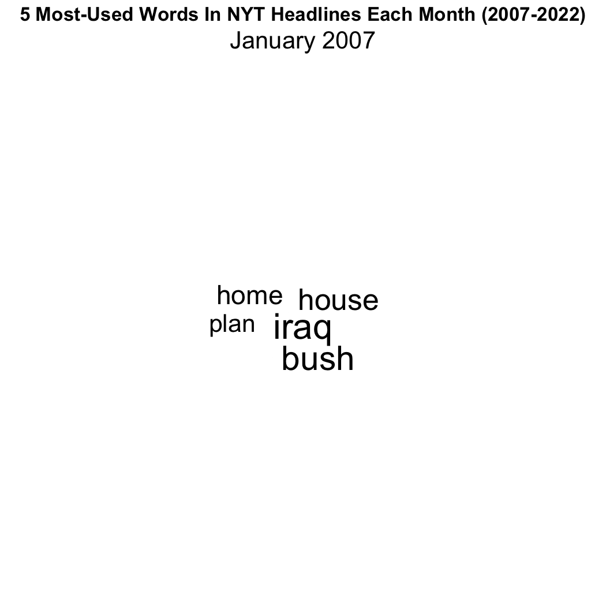

# Animated Word Clouds

Looking into past news cycles can be a time capsule for how people viewed certain events. To help visualize this concept, we can make a word cloud with words from New York Times headlines of the past 16 years.

In this section, we'll be making this plot:

<figure><figcaption></figcaption></figure>

The dataset is available for download [here](https://www.kaggle.com/datasets/jordankrishnayah/45m-headlines-from-2007-2022-10-largest-sites).

***

Let's get the libraries we'll be using.

```r
library(tidyverse) #getting the data
library(dplyr) #wrangling the data
library(gganimate) #animating the word cloud
library(ggwordcloud) #making the word cloud
library(stopwords) #filtering out stopwords from headlines
library(tokenizers) #tokenizing the headlines
library(ggplot2) #plotting the table
```

With our libraries in place, we can load in the data.

```r
headlines <- read_csv("headlines.csv")
```

<figure><figcaption></figcaption></figure>

Next, we'll filter out non-NYT publications, to narrow our focus.

```r
nyt_headlines <- headlines |> 
  filter(Publication == "New York Times")
```

Before we do any more changes, we'll need to fix up the `Date` column in our data frame to allow R to interpret it as a date type.

```r
nyt_headlines$Date <- as.Date(as.character(nyt_headlines$Date), format="%Y%m%d")
```

<figure><figcaption></figcaption></figure>

Though we've narrowed our dataset down to around 500,000 rows, we still have to compress our data. Right now, there's too much variability in our data: headlines change too frequently between each day. To counter this while not losing any data, we can simply group our data by month.

We have to be careful, though, since we still want to iterate over our data as if it were "standard" dates, so it's easier to get information from later. So, we can group by every month, and as a placeholder, make each month the first:&#x20;

```r
nyt_headlines <- nyt_headlines |> 
  filter(!is.na(Headline)) |> 
  mutate(Year_Month = as.Date(paste0(format(Date, "%Y"), format(Date, "%m"), "01"), format="%Y%m%d")) |> 
  filter(Year_Month < "2023-01-01")
```

This code segment sets us up for grouping, by making the `Year_Month`  column, with which to group by. We're filtering here to make the data easier to describe (2007-2022 is easier to say than 2007-2023/01/01).

Let's now group by each month of each year. While we're at it, we can tokenize our data, which is a fancy way of saying splitting it up into individual tokens or words.

Tokenizing is done through the `tokenize_words` function, which allows us to filter out certain stop words. We'll use the stopwords found within the `stopwords` package.

```r
nyt_headlines <- nyt_headlines |> 
  group_by(Year_Month) |> 
  summarize(
    Headlines = paste(Headline, collapse = " "),
    Words = unlist(tokenize_words(Headlines, stopwords = stopwords("en")))
  )
```

The syntax might seem a bit confusing: all we're doing is grouping by every month of every year, pasting together the headlines of all articles for that month (separated by a space), and then using that very long string with the tokenize words function to split it up into a list with all words.

The `unlist` function just separates this list into rows, so that each row has a `Year_Month`, the `Headlines` for that month and a word that was featured in those headlines (with repeats).

Our data now looks like this (it might take a few seconds to load):

<figure><figcaption></figcaption></figure>

Now that we've tokenized, we can get rid of the Headlines column, which will speed up our work.

```r
nyt_headlines <- nyt_headlines[-2]
```

We now have to group up our data to count the number of occurrences of each word in each month (in each year).

```r
word_count <- nyt_headlines |> 
  group_by(Words, Year_Month) |> 
  summarize(
    count = n()
  )
```

<figure><figcaption></figcaption></figure>

This peek in our dataset foreshadows our next move, which is to filter out certain unneeded or artificially boosted words. Unneeded words include numbers or special characters, and artificially boosted words like "new", "york", and "times", for instance.

```r
word_count_five <- word_count |> 
  filter(!(tolower(Words) %in% c("new", "york", "times", "nyt"))) |> 
  filter(!(tolower(Words) %in% c("min", "read", "review", "editorial", "now",
                                 "comments", "getty", "images", "theater",
                                 "movie", "slide", "show", "television", "books",
                                 "op","ed"))) |> 
  filter(!grepl("[^A-Za-z0-9 ]", Words)) |> 
  filter(!(Words == "")) |>
  filter(nchar(Words) > 1) |>  
  group_by(Year_Month) |> 
  arrange(desc(count)) |> 
  slice_head(n = 5)
```

The first two filters take out "boosted" words, the next one is to ensure all characters are non-special, and the next two after that are to select words that are non-empty.

Next, we group by each month in each year, order by the number of appearances of each word, and take the top five words for each group.

<figure><figcaption></figcaption></figure>

This looks great. We're now ready to make our word cloud. First we'll set the seed, which is good practice.

```r
set.seed(52)
```

Since word clouds are fairly simple, we can jump right into the animation.

```r
word_cloud <- word_count_five |> 
  ggplot()+
  geom_text_wordcloud(aes(label=Words, size=count))+
  theme_minimal()+
  scale_size_area(max_size = 20)+
  transition_time(Year_Month)
```

Here, we're just making a word cloud through `ggplot`, setting each label to be a word, and the size to be the number of occurrences it has for each month in each year. Standard stuff.&#x20;

We'll use `theme_minimal` as a baseline, and to increase the overall size of words in the cloud. Then we transition along the time variable we created, with one frame per month in each year (to not arbitrarily shuffle words, since words change position each frame). To make sure we're getting the frames right, we need to animate it manually.

```r
animate(word_cloud, fps = 4, duration = 48, height = 7,
        width = 7, units = "in", res = 150)
```

We have 16 years worth of data, with 12 months per year, meaning we have 192 frames to get through. To get through all the data with one frame per month, we can set the `duration` to 48 and the `fps` to 4 (since 4\*48 = 192).&#x20;

<figure><figcaption></figcaption></figure>

We're still missing some information in our chart: a title and a subtitle showing the current month and year being displayed.

The syntax for this is a bit messy bit we're just converting the frame\_time to a date, getting the month from that date, converting that month to a numeric, and then finding the word name for that month. We repeat the same process for the year, and concatenate the two together.

```r
subtitle = "{paste(month.name[as.numeric(format(as.Date(frame_time),\"%m\"))]
       format(as.Date(frame_time),\"%Y\"))}"
```

If we add this subtitle and some other elements to make our plot look better, we get this:

```r
word_cloud <- word_count_five |> 
  ggplot()+
  geom_text_wordcloud(aes(label=Words, size=count))+
  theme_minimal()+
  scale_size_area(max_size = 20)+
  transition_time(Year_Month)+
  labs(subtitle = "{paste(month.name[as.numeric(format(as.Date(frame_time),\"%m\"))],
       format(as.Date(frame_time),\"%Y\"))}",
       title = "5 Most-Used Words In NYT Headlines Each Month (2007-2022)")+ #added line
  theme(plot.title = ggtext::element_markdown(size=16, hjust=0.5, face="bold"),
        plot.subtitle = ggtext::element_markdown(size=20, hjust=0.5), face="bold") #added line
```

<figure><figcaption></figcaption></figure>

While this is a good standalone resource, it might be a bit difficult for the viewer to remember which words were seen when. To combat this, we can add a "log", or a table of past number one words.&#x20;

To do this, we'll have to combine our word cloud with an animated table. Combining two animations can be done through the `magick` library, which has a unique way of parsing animations. As we move on to make the table, we'll save the word cloud using a magick function, to use later on.

```r
mgif_word_cloud <- magick::image_read(animate(word_cloud, fps = 4, duration = 48, height = 7,
                                              width = 7, units = "in", res = 150))
```

Since the table only contains the number one most used word for each month in each year, it'll be easier if we made a new data frame that has only the number one words.&#x20;

```r
word_count_one <- word_count |> 
  filter(!(tolower(Words) %in% c("new", "york", "times", "nyt"))) |> 
  filter(!(tolower(Words) %in% c("min", "read", "review", "editorial", "now",
                                 "comments", "getty", "images", "theater",
                                 "movie", "slide", "show", "television", "books",
                                 "op","ed"))) |> 
  filter(!grepl("[^A-Za-z0-9 ]", Words)) |> 
  filter(!(Words == "")) |>
  filter(nchar(Words) > 1) |>  
  group_by(Year_Month) |> 
  arrange(desc(count)) |> 
  slice_head(n = 1)
```

This is the same exact syntax as before (where we took the top five for each month), but the `slice_head` function is now only take the top one word for each month.

We're now going to ramp up a bit and use a few functions to plot the frames of the table. The way that `magick` combines images to make animations allows us to fairly easily convert stills to nice animations. Essentially, `magick` overlays images on top of one another to make an animation, which means that if we have a transparent background for our plot, we only need to display one word per frame, but it'll appear as if there are more than one on screen. Without this overlay feature, if we were to do the table animation, we would need 192 `geom_text` calls, but with it, just one does the trick.

Essentially:

<div>

<figure><figcaption></figcaption></figure>

 

<figure><figcaption></figcaption></figure>

 

<figure><figcaption></figcaption></figure>

</div>

These three images combined would produce a frame with three words on it, even though each frame only has one.

So, for every month, we need to display the number one word in an appropriate position and then combine these images into a gif, so that each word is revealed as the animation progresses.

To do this, we can use this function:

```r
year_log <- function(date, index){
  print(date)
  plot <- ggplot(word_count_one)+
    geom_text(x=year(date),y=12-month(date), label=word_count_one$Words[which(word_count_one$Year_Month == floor_date(date, "month"))], fontface="plain")+
    xlim(2005,2023)+
    ylim(-1,13)+
    theme_void()
  ggsave(plot=plot, file=paste0("image_sequence/",formatC(index, width = 3, format = "d", flag = "0"),".png"), width=15, height=7, units="in",dpi=150)
}
```

This function takes in a given date and index value for the png output, and plots a `geom_text` word at an X that corresponds to the year, and Y that corresponds to the month (inverted so that later months are below), so that the total animation will form into a table.&#x20;

The actual word that gets plotted is a bit complicated to decipher, but essentially, we find the `Year_Month` that equals the date given to the function, and fund the Words that corresponds to that date.

For formatting, we limit the x and the y axes to appropriate values, and save the plot to a file path specified by a number with three digits (that could be filled with leading zeros), as given by the `formatC` function.

Ensure that the height is the same value we supplied to our word cloud animation, so that when we combine the plots, the charts are aligned. Really, we have to make sure that DPI\*height of this plot is equal to the res\*height of the word cloud, but since the DPI is the same as the res, we just make sure the heights are equal.

When we run this function for the first month in our dataset (with an arbitrary index, for now), we get this image:

<figure><figcaption></figcaption></figure>

While the word is in the right place, there ins't any information about what month or year it corresponds to. To fix this, we can make some new functions for axes and add those to our original `year_log` function.

Remember that the images are being overlayed over one another, so we don't want any unnecessary overlaps. This means that each of the values on the axis should only be displayed once. Let's have each month and year label appear on the first time a word is displayed within that category. This means that the first time "March" is displayed on the Y axis is 2007-03-01 and the first time "2010" is displayed on the X axis is 2010-01-01.&#x20;

So, for every date that our `year_log` function takes in, we should plot (if needed) the appropriate axis label.

With those specifications in mind, we can implement the `table_axis` function:

```r
table_axis <- function(date){
  label <- geom_text(y=0,x=0,label="")
  if (year(date) == 2007){
    label <- geom_text(y=12-month(date),x=2006,label=months(date), fontface="bold", color="gray")
  }
  if(month(date) == 1){
    label <- c(label,geom_text(y=12, x=year(date), label=year(date), fontface="bold", color="gray"))
  }
  return(label)
}
```

This function takes in a date, and initializes a label object. If it's 2007, then the label should be the corresponding month, since all 2007 dates will be the first time all months will need to be displayed (i.e. September 2007 is the first September we're showing).

If it's January, then we also need to plot the year, since January will be the first time all years will need to be displayed (i.e. January 2010 is the first 2010 we're showing). We then combine this with the first label (which is either showing the month or showing nothing) and return it.

If the label is for the Y axis (months), then its Y position corresponds to the appropriate month position and its X is to the left of all year values (since dates start at 2007). The same concept applies for the X axis labels (years), which are placed above all the data (since the January position, or the highest Y value is 12-1=11).

The grey color is used to differentiate that axes labels from the data, which is colored black by default.

We can now put this function back in our `year_log` method, and since we're returning a `geom_text` call, it can just be placed within the `ggplot` block:

```r
year_log <- function(date, index){
  print(date)
  plot <- ggplot(word_count_one)+
    table_axis(date)+ #added line
    geom_text(x=year(date),y=12-month(date), label=word_count_one$Words[which(word_count_one$Year_Month == floor_date(date, "month"))], fontface="plain")+
    xlim(2005,2023)+
    ylim(-1,13)+
    theme_void()
  ggsave(plot=plot, file=paste0("image_sequence/",formatC(index, width = 3, format = "d", flag = "0"),".png"), width=15, height=7, units="in",dpi=150)
}
```

We can add a title via `geom_text` in a very similar fashion.&#x20;

```r
table_titles <- function(date){
  if(date == as.Date("2007-01-01")){
    return(geom_text(y=13, x=2014.5, label="Most-Used Word In NYT Headlines Each Month", fontface="bold", color="black", size=8))
  }
}
```

Since we only want the title to be shown on one frame (to prevent overlaps), but be visible to all later frames, we'll only show it on the first date.&#x20;

Let's now add this function back to our `year_log`:

```r
year_log <- function(date, index){
  print(date)
  plot <- ggplot(word_count_one)+
    table_axis(date)+
    table_titles(date)+ #added line
    geom_text(x=year(date),y=12-month(date), label=word_count_one$Words[which(word_count_one$Year_Month == floor_date(date, "month"))], fontface="plain")+
    xlim(2005,2023)+
    ylim(-1,13)+
    theme_void()
  ggsave(plot=plot, file=paste0("image_sequence/",formatC(index, width = 3, format = "d", flag = "0"),".png"), width=15, height=7, units="in",dpi=150)
}
```

With these three functions, we can print a frame that corresponds to any date along our data. For instance, here's the first three images in the sequence:

<div>

<figure><figcaption></figcaption></figure>

 

<figure><figcaption></figcaption></figure>

 

<figure><figcaption></figcaption></figure>

</div>

To put everything together, though, we need one more function to actually cycle through and print the dates.

```r
combined_year_log <- function(start_date){
  end_date <- as.Date("2022-12-01")
  curr_date <- start_date
  index <- 0
  while(curr_date <= end_date){
    year_log(curr_date, index)
    index <- index + 1
    curr_date <- curr_date %m+% months(1)
  }
}
```

This function takes in the start date and goes up to the last month in our data, which is December 2022. We'll use a very standard set up for cycling through data, which is to set a `curr_date` as our variable to be incremented, initialized to the start date. The index is just to give to our `year_log` function, so that we control the naming of our files.&#x20;

While the current date is less than or equal to our ending date, we call `year_log` to plot and save each frame, then increment the index by one and the `curr_date` by one month.

We're now ready to finally get all the frames for the table animation.

```r
combined_year_log(as.Date("2007-01-01"))
```

We can call our looping function to start the process, and watch as the dates continually increase by one month in the console. This function should take about 30 seconds to run.

<figure><figcaption></figcaption></figure>

We're now on the home stretch. Although we just rendered the image sequence as pngs, we have to do some formatting to allow `magick` to read it properly. We're going to convert the files to a gif, then feed that gif into magick like we did for the word cloud.

```r
png_files <- sort(list.files("image_sequence", pattern = ".*png$", full.names = TRUE))
```

We start with reading all the png files into a vector through `list.files`. We supply the directory, the ending file format, and tell R that we want to prepend the "image\_sequence" directory to each of our file names via `full.names`.

```r
gifski::gifski(png_files, gif_file = "animation.gif", width = 15*150, height = 7*150, delay = 1)
```


Next, with the `gifski` package installed, we can convert that png sequence to a gif. Make sure that the height and width parameters Are equal to the height and width we supplied to the `ggsave` call in the `year_log` function, but multiplied by the DPI (so that we don't mess up the scale of our plot).

In our working directory, we should now see a file titled animation.gif. Note that the layering effect isn't present to us, but when we give this to `magick`, it will layer each image.

<figure><figcaption></figcaption></figure>

Finally, we need to convert this into a `magick` object.

```r
mgif_word_log <- magick::image_read("animation.gif")
```

Recall that we saved the word cloud under the name `wgif_word_cloud`, so now, we have two magick elements ready to be combined.

We'll use `image_append` to combine the plots, with the right argument on the right and the left argument on the left.

```r
new_gif <- magick::image_append(c(mgif_word_cloud[1], mgif_word_log[1]))
```

With `new_gif` initialized, we can now cycle through it with a for loop. Since there's exactly one frame per month, and 192 frames, we can just call:

```r
for(i in 2:192){
  combined <- magick::image_append(c(mgif_word_cloud[i], mgif_word_log[i]))
  new_gif <- c(new_gif, combined)
}
```

To combine the images and then append that frame to the `new_gif` object.

Once we've gone through every frame, we should add an end pause. This is very simple to do, we just cycle through and combine and append only the end frame of each animation.

```r
for(x in 1:30){
  combined <- magick::image_append(c(mgif_word_cloud[192], mgif_word_log[192]))
  new_gif <- c(new_gif, combined)
}
```

The last call we'll make is to write the gif to a file path:

```r
magick::image_write(new_gif, path = "final.gif", format = "gif")
```

Here, the parameters are self-explanatory: `new_gif` is the file, the path is the name of the file/path it will be written to, and the format is a .gif. This call should take about a minute or so to complete (unlike `gganimate`, there is no progress bar).

That's it! We've now made a really nice word cloud animation with a corresponding table.

Note that if you desire to change the FPS from the standard (which is 3.5 in this case), we have to do a little workaround. We need to render each image on top of one another, but converting new\_gif to an animation object to change its FPS will stop that feature from occurring: images will be replaced instead of layered. So, to workaround this, we can first write the image, then read it, animate it, and finally write it again to preserve the desired layering effect.

This works since we're animating the already-layered animation, so the layering effect can't be changed.

```r
magick::image_write(new_gif, path = "final.gif", format = "gif")

#to change the fps, below:
new_gif <- magick::image_read("final.gif")
new_gif <- magick::image_animate(new_gif, fps = 4)
magick::image_write(new_gif, path = "final.gif", format = "gif")
```

This adds a few minutes to our rendering time, since writing and reading are relatively expensive tasks.


[Click here to view the raw file used to make this animation.](../appendix/advanced-animations/animated-word-cloud.r.md)

