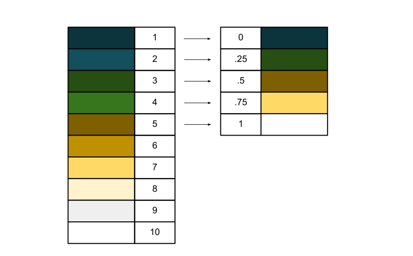

# Interactive 3D Maps

In a way, having a live interactive feature for a plot is a way of generating an animation: each unique user movement counts as a mini-animation. This section relies on the template provided by [Carson Sievert](https://github.com/plotly/plotly.R/blob/master/demo/sf-plotly-3D-globe.R).&#x20;

We can push R to its limits by generating a 3D interactive globe that displays data on the world's earthquakes.&#x20;

The final product is an interactive html page that is viewable [here](https://nikhilc52.github.io/animation\_links/). Below is a preview.

<figure><figcaption></figcaption></figure>

The data to we'll use to make this visual is available [here](https://www.kaggle.com/datasets/warcoder/earthquake-dataset).

***

This section and the following section are some of the more difficult visuals we're making. We'll start with loading in our libraries.

```r
library(plotly) #making the plot
library(tidyverse) #cleaning the data
library(dplyr) #wrangling the data
library(stars) #reading a png file as a matrix
```

Next, we'll load in the data.

```r
earthquakes <- read_csv("earthquakes.csv")
```

<figure><figcaption></figcaption></figure>

Since we're going to be mapping the longitude and latitude of each earthquake to a three dimensional space, it'll be efficient and useful if we define a simple function that converts degrees to radians, so that we can more easily call trigonometric functions.

```r
degrees2radians <- function(degree) degree * pi / 180 
```

With our function defined, we can now find the X, Y, and Z coordinates for each of the earthquakes.

```r
earthquakes <- earthquakes |> 
  mutate(x=1.01 * cos(degrees2radians(longitude)) * cos(degrees2radians(latitude))) |> 
  mutate(y=1.01 * sin(degrees2radians(longitude)) * cos(degrees2radians(latitude))) |> 
  mutate(z=1.01 * sin(degrees2radians(latitude)))
```

The formulas are a little complicated, and explanations can be found [here](https://tutorial.math.lamar.edu/Classes/CalcII/SphericalCoords.aspx), but are at a Calculus II level, so I won't go into too much depth. For now, just trust that they work, and we'll be referring back to them frequently. Note that the radius in this formula is 1.01 (and the surface has a radius of 1), which means that our points will be in the layer above the sphere, allowing them to be more visible.

We'll add a very simple color scale for our data points here (which will later be mapped to the significance variable). While having a scale like this is typically not encouraged, when the backing image features earth tones, it's a bit difficult to make our points stand out, so we'll stick with red.

The first vector gives percentiles for each corresponding color defined in the second vector.

```r
manual_colorscale <- list(c(0,0.2,0.4,0.6,0.8,1),
                          c("white","#ffa590","#ff8164","#ff6242",
                            "#fb4b1e","#c61a09")) 
```

That's all the work we have to do for our earthquake data frame, so we can now move on to making the satellite image surface. The image we're going to be using can be found [here](https://raw.githubusercontent.com/nikhilc52/animation\_links/main/surface.png).

To make things easier to interpret, we're going to set an `x_size` and `y_size` variable to limit the quality of our image and ensure that every data frame has the corresponding size.&#x20;

```r
x_size <- 1000
y_size <- 500
```

This basically means that we're going to have 50,000 pixels representing our surface image, 1000 on the x and 500 on the Y. This matches the aspect ratio of the image we're using, which has dimensions of 1440x720. Ideally, we would go all the way up to 1440 for our `x_size` and 720 for the y, but in the interest of limiting the file size of our final output, we're only going to 1000 pixels.

Having set our limits, we can bring in the image.

```r
raw_tif <- read_stars("surface.png",
                      RasterIO = list(nBufXSize=x_size, nBufYSize=y_size))
```

The syntax here just tells R how large the image should be on the X and on the Y.

We'll now convert the tif to a data frame for us to use.

<pre class="language-r"><code class="lang-r"><strong>rgb &#x3C;- as.data.frame(raw_tif)
</strong></code></pre>

<figure><figcaption></figcaption></figure>

There are three values in the band column (1, 2, 3), each representing a color (red, green, blue). To map an actual RGB value to each location, we need to combine the data so that each x and y has a corresponding red, green, and blue column with appropriate color values. We can do this with through the `pivot_wider` function from `tidyr`, modifying our previous call:

```r
rgb <- as.data.frame(raw_tif) |> 
  tidyr::pivot_wider(names_from = band, values_from = surface.png) #requires tidyr in installed
```

We're telling R to add three columns (corresponding to the three "names" found within the `band` column) and populate them with the values stored in each of the rows `surface.png` column. Our call yeilds this dataframe:

<figure><figcaption></figcaption></figure>

To make it easier for us to work with the data, it's best if we change the column names to a descriptive string value:

```r
colnames(rgb)[3] <- "red"
colnames(rgb)[4] <- "green"
colnames(rgb)[5] <- "blue"
```

This gives us exactly what we need: a red, green, and blue value for each X and Y location. There's some more manipulation we have to do to finish mapping the surface correctly.&#x20;

<figure><figcaption></figcaption></figure>

This includes setting up a column with a hex value for R to interpret (in our scale), and another column with an integer that uniquely represents a color for R to interpret (in the actual surface).

```r
rgb$color <- rgb(rgb$red/255,rgb$green/255,rgb$blue/255)
rgb$color_int <- 256 * 256 * rgb$red + 256 * rgb$green + rgb$blue 
```

The color column is self explanatory - we just supply the red, green, and blue value divided by 255 since the rgb function only uses numbers from 0-1 for its parameters, and there are 255 values for a possible red/green/blue band.&#x20;

The `color_int` column is a bit more complicated, but generates a unique value for any color's RGB values. We'll need this in order to find an appropriate order to give R for the scale we'll eventually set up.

<figure><figcaption></figcaption></figure>

The way that `plotly` interprets surface colors is through a matrix object. Since our data is currently in a data frame format, we need to convert it. We need to be careful here, though, since this conversion can cause a lot of errors if it's wrong. The resulting matrix should essentially be a pixelated version of the original png file we supplied.

```r
rgb_earth <- matrix(data=rgb$color_int, nrow=y_size, ncol = x_size, byrow=TRUE)
```

The matrix function uses the data within the `color_int` column to fill in its cells. Since the matrix should be a mirror of the image we supplied, there should be as many rows as there are y values in our image and as many columns as there are x values in our image (using the variables defined earlier). Since the data in the rgb data frame is ordered by x values, we're filling in our data by rows (meaning we put in all the data for the first row, then the second, then the third, etc).&#x20;

<figure><figcaption></figcaption></figure>

It's a bit difficult to make sure we've done this step correctly, but one simple (and optional) way is to export the data to a csv, open the csv in Excel, and then apply conditional formatting to all the values with 132372 (which corresponds to the blues used to color the ocean).

```r
write_csv(as.data.frame(rgb_earth), "check.csv")
```

<figure><figcaption></figcaption></figure>

After shrinking the column width to 2 in Excel, we get this plot, which confirms that we've done all the steps correctly so far. We'll now quickly set the corresponding X and Y values for `plotly` to interpret (as a new matrix), since our `rgb_earth` matrix doesn't have them.&#x20;

```r
lat <- seq(-90, 90, length.out = y_size)
lon <- seq(-180, 180, length.out = x_size)
lat <- matrix(rep(lat, x_size), nrow = y_size)
lon <- matrix(rep(lon, each = y_size), nrow = y_size)
```

All we're doing here is making two new matrices (one for the latitude values and one for the longitude values), that follow the same dimensions as our `rgb_earth` matrix, so that when fed into `plotly`, each color will map to the correct location.

<figure><figcaption></figcaption></figure>

<figure><figcaption></figcaption></figure>

We're now ready to color our surface as accurately as possible.

As it stands, if we were to plot our surface right now, we'd get a monochrome color scale of the Earth. To add color, we need to define our own scale. This is where the integer values for our colors comes to use. We can define a scale that takes the values of each color and maps them to an approximate color:

<figure><figcaption></figcaption></figure>

In this example, the integer values clearly correspond to a percentile for the scale, so that when R reads the numeric integer, it can directly map its value to the appropriate, approximate color given by its percentile.

The object on the left is what we start out with, and through some manipulation, we end up with the object on the right.

```
earth_colorscale <- distinct(data.frame(rgb$color_int, rgb$color))
```

<figure><figcaption></figcaption></figure>

Here, we're just finding all the unique color values and integers, so that we don't have to do any duplicate mapping.

Now, we'll arrange our `rgb.color_int` column in ascending order:

```r
earth_colorscale <- earth_colorscale |> arrange(rgb.color_int)
```

<figure><figcaption></figcaption></figure>

Here's the hard part. `Plotly` doesn't allow us to have more than around 255 colors in our scale, but we have 65,706 distinct colors in our plot. To counter this, we'll define a simple heuristic function to delete every other row from our data frame to help narrow down our dataset. From iteration to iteration this shouldn't remove too much quality: two colors that are right next to each other are fairly similar, so removing one won't make too much of a difference.

We'll repeat this process until there are 255 or less colors in our scale:

```r
while(nrow(earth_colorscale) > 255){
  toKeep <- seq(0, nrow(earth_colorscale), 2)
  earth_colorscale <- earth_colorscale[toKeep, ]
  rownames(earth_colorscale) = NULL
}
```

`toKeep` is just a list of all the even-numbered indices, which are then kept (and the odd indices deleted) in the next line. The row names being set to null just resets the row numbers in our data frame, otherwise we'd just be left with even indices.

<figure><figcaption></figcaption></figure>

Our color scale now looks like this.

With all the colors set, we now have to define the breaks. Since we want all the colors to have equal weights, we'll increment the percentiles for each row evenly:

```r
earth_colorscale$breaks <- seq(1:nrow(earth_colorscale))/nrow(earth_colorscale)
```

<figure><figcaption></figcaption></figure>

Since `plotly` requires the breaks column starts with percentile 0, we're just going to manually set the first row to 0:

```r
earth_colorscale$breaks[1] = 0
```

We'll also get rid of the first row, since we no longer need it to order the data (breaks can now do that for us). Lastly, we're going to change the name of the rgb.color column to just color, for `plotly` to interpret it.

```r
earth_colorscale <- earth_colorscale[,c(3,2)]
names(earth_colorscale)[names(earth_colorscale) == 'rgb.color'] <- 'colors'
```

<figure><figcaption></figcaption></figure>

It might be a bit difficult to understand what we did, but essentially, any colors that have a (integer) value within the first 1.5% of all integer values (which ranges from 0 to .015 \* 16,711,680), will correspond to the color represented by '#001122'. The next .8% of integer values will correspond to the color represented by '#010E11', and so on. Here's what the scale looks like when colored:

<figure><figcaption></figcaption></figure>

Obviously, mapping down more than 65 thousand colors down to just 128 will cause some discoloration, but for the most part, our plot should be accurate.

We'll now work on setting up the plotting environment. Since we just want the globe to be shown, we'll create an empty axis variable to feed into `plotly`:

```r
empty_axis <- list(
  showgrid = FALSE, 
  zeroline = FALSE,
  showticklabels = FALSE,
  showspikes = FALSE,
  spikesides = FALSE,
  title = ""
)
```

This just gives us a set of standard elements we don't want showing in our plot.

Plotting the data is fairly simple:

```r
globe <- plot_ly(width=800,height=800) |> 
  add_sf(
    data = sf::st_as_sf(maps::map("world", plot = FALSE, fill = TRUE)),
    x = ~ 1.001 * cos(degrees2radians(x)) * cos(degrees2radians(y)),
    y = ~ 1.001 * sin(degrees2radians(x)) * cos(degrees2radians(y)),
    z = ~ 1.001 * sin(degrees2radians(y)),
    color = I("black"), size = I(1),
    hoverinfo = "none"
  ) 
```

We're supplying the `plotly` object with some basic height and width parameters, then adding an `sf` object to our plot. The data that the `sf` object refers to is the standard maps package world map, and we're mapping the x and y to three dimensions. Note that the self-reference of x and.y variables is unique to the `add_sf` call - for other sections we'd need to supply a column of a data frame. We're supplying the color as black and the size to be one so the outline isn't too distracting, with no information being presented when the user hovers over a line. The `I()` function tells R to interpret the color and size as direct inputs: black means the color black and nothing else as does the size of 1.

When we run globe, we get this plot:

<figure><figcaption></figcaption></figure>

This is a good start. We'll now add the earthquake data we cleaned way earlier.

<pre class="language-r"><code class="lang-r">#continued from call to plotly above
  |>
  add_trace(
    x=earthquakes$x,
    y=earthquakes$y,
    z=earthquakes$z,
    mode = "markers", type = "scatter3d",
    marker = list(color = earthquakes$magnitude, size = earthquakes$sig/100, colorscale = manual_colorscale, showscale=TRUE,
                  colorbar=list(title=list(text="Magnitude",side="top"), thickness=10, len=0.35,orientation='h',y=0.1,
                                tickfont=list(family="Arial"), nticks=6)),
<strong>    text = paste0("Description: ", earthquakes$title, "&#x3C;br>", "Time: ", earthquakes$date_time, "&#x3C;br>" ,
</strong>                  "Magnitude: ", earthquakes$magnitude, "&#x3C;br>", "Significance: ", earthquakes$sig),
    hoverinfo = "text"
  ) 
</code></pre>

Since we already did the trigonometry calculations above, we can just supply the X, Y, and Z values in earthquakes to their appropriate parameters. We're using "markers" as our mode (as opposed to lines), with their type being a scatter3d point.

Within the list of characteristics of the marker, we've supplied the color as the magnitude and the size as the earthquakes significance (scaled down by 100). Note that `plotly` does not have a way of plotting multiple aesthetics of a single trace, so we'll add in a scale for size as a png, manually.&#x20;

For the color, however, we can set our scale up within R. We'll supply `manual_colorscale`, which was the `colorscale` we created to `colorscale` and indicate that we want to show our scale. Next, we'll tidy the labels and positioning of our color bar.

After that, we'll add the text to display when a point is hovered over. This includes the earthquake description (title), time, magnitude, and significance (separated by HTML line breaks). To indicate that we want text to be shown on hover, we give `hoverinfo="text"`. This addition gives us:

<figure><figcaption></figcaption></figure>

We can now add the satellite image surface background.

```r
 #continued from call to plotly above
 |>
  add_surface(
    x = cos(degrees2radians(lon)) * cos(degrees2radians(lat)),
    y = cos(degrees2radians(lat)) * sin(degrees2radians(lon)),
    z = -sin(degrees2radians(lat)),
    surfacecolor=rgb_earth,
    colorscale=earth_colorscale,
    showscale = FALSE, 
    hoverinfo = "none",
    lightposition = list(
      x=2,
      y=2,
      z=2
    ),
    contours = list(
      x = list(highlight = FALSE), 
      y = list(highlight = FALSE), 
      z = list(highlight = FALSE)
    )
  )
```

Here, we using our reference matrices for longitude and latitude to convert each pixel to its appropriate X, Y, and Z location. Note that the Z is inverted - we're doing this conversion here since it's easier than flipping a matrix.

We're supplying basic information like the `surfacecolor` to map to our `rgb_earth` matrix and the color scale to the one we defined for earth's color palette. We're not going to show the scale for our colors, and we're not going to have any info revealed on hover.&#x20;

We'll add the light in at any arbitrary position decently far from our globe to light the scene and make sure that there aren't any contours (slices through the plot) displayed when we're hovering.

<figure><figcaption></figcaption></figure>

We're almost done. We just need to tidy up our environment.&#x20;

```r
 #continued from call to plotly above
 |>
  layout(
    title=list(text="<br><b>Earthquakes Since 1995</b>",font=list(family="Arial", size=30)),
    showlegend = FALSE,
    scene = list(
      xaxis = empty_axis,
      yaxis = empty_axis,
      zaxis = empty_axis,
      aspectratio = list(x = 1, y = 1, z = 1)
    )
  ) |> 
  config(displayModeBar=FALSE)
```

Here, we're generating and formatting our title and indicating that we don't want to show a legend for the traces (i.e. the `trace0`, `trace1` in the top right corner, not the magnitude `colorbar`). We're also clearing the axes with the list we initialized above. Finally, we lock the aspect ratio to something readable, and hide the small "Plotly.js" tag line at the top right of the plot.

<figure><figcaption></figcaption></figure>

We still need to add our manual size legend, though. To do that, we can either link an "https" link or use a base64 encoder to give the image to plotly. To keep things as customizable as possible, I'll go over the base64 encoder, which allows you to place any png in the plot. The png we'll be referencing is visible [here](https://raw.githubusercontent.com/nikhilc52/animation\_links/main/size\_scale.png). For our purposes, we don't have to worry too much about how this function works.

To load the png into R, we'll call:

```r
image <- RCurl::base64Encode(readBin("size_scale.png", "raw", file.info("size_scale.png")[1, "size"]), "txt")
```

Then, within our layout section, we'll add these lines to fit the png into our plotting area:

```r
images=list(list(source=paste('data:image/png;base64', image, sep=','),
                     xref="paper",
                     yref="paper",
                     x=0.5,
                     y=0.1,
                     sizex=.25,
                     sizey=.25,
                     xanchor="center",
                     yanchor="center"))
```

"paper" makes the text anchored to the area of the plot (not the axes within the plot), so we can have our image be near the position of the `colorbar`. The rest of the parameters are self-explanatory and should be simple to tweak if needed. Note that if you wanted to use the "https" link to the image, we could forgo the above initialization of image and just paste the link into the source parameter:

```r
source='https://raw.githubusercontent.com/nikhilc52/animation_links/main/size_scale.png'
```

If we put all of our calls together:

```r
image <- RCurl::base64Encode(readBin("size_scale.png", "raw", file.info("size_scale.png")[1, "size"]), "txt")

globe <- plot_ly(width=800,height=800) |> 
  add_sf(
    data = sf::st_as_sf(maps::map("world", plot = FALSE, fill = TRUE)),
    x = ~ 1.001 * cos(degrees2radians(x)) * cos(degrees2radians(y)),
    y = ~ 1.001 * sin(degrees2radians(x)) * cos(degrees2radians(y)),
    z = ~ 1.001 * sin(degrees2radians(y)),
    color = I("black"), size = I(1),
    hoverinfo = "none"
  ) |>
  add_trace(
    x=earthquakes$x,
    y=earthquakes$y,
    z=earthquakes$z,
    mode = "markers", type = "scatter3d",
    marker = list(color = earthquakes$magnitude, size = earthquakes$sig/100, colorscale = manual_colorscale, showscale=TRUE,
                  colorbar=list(title=list(text="Magnitude",side="top"), thickness=10, len=0.35, orientation='h', y=0.1,
                                tickfont=list(family="Arial"), nticks=6)),
    text = paste0("Description: ", earthquakes$title, "<br>", "Time: ", earthquakes$date_time, "<br>" ,
                  "Magnitude: ", earthquakes$magnitude, "<br>", "Significance: ", earthquakes$sig),
    hoverinfo = "text"
  ) |>
  add_surface(
    x = cos(degrees2radians(lon)) * cos(degrees2radians(lat)),
    y = cos(degrees2radians(lat)) * sin(degrees2radians(lon)),
    z = -sin(degrees2radians(lat)),
    surfacecolor=rgb_earth,
    colorscale=earth_colorscale,
    showscale = FALSE, 
    hoverinfo = "none",
    lightposition = list(
      x=2,
      y=2,
      z=2
    ),
    contours = list(
      x = list(highlight = FALSE), 
      y = list(highlight = FALSE), 
      z = list(highlight = FALSE)
    )
  ) |>
  layout(
    title=list(text="<br><b>Earthquakes Since 1995</b>",font=list(family="Arial", size=30)),
    showlegend = FALSE,
    images=list(list(source=paste('data:image/png;base64', image, sep=','),
                     xref="paper",
                     yref="paper",
                     x=0.5,
                     y=0.1,
                     sizex=.25,
                     sizey=.25,
                     xanchor="center",
                     yanchor="center")),
    scene = list(
      xaxis = empty_axis,
      yaxis = empty_axis,
      zaxis = empty_axis,
      aspectratio = list(x = 1, y = 1, z = 1)
    )
  ) |> 
  config(displayModeBar=FALSE)
```

That's all! We've now made a cutting-edge interactive model with 3D mapping exclusively within R. If you want to have the camera move to generate a movie within the R environment, see the next section for how to get smooth camera movement.


[Click here to view the raw file used to make this animation.](../appendix/advanced-animations/interactive-3d-maps.r.md)

