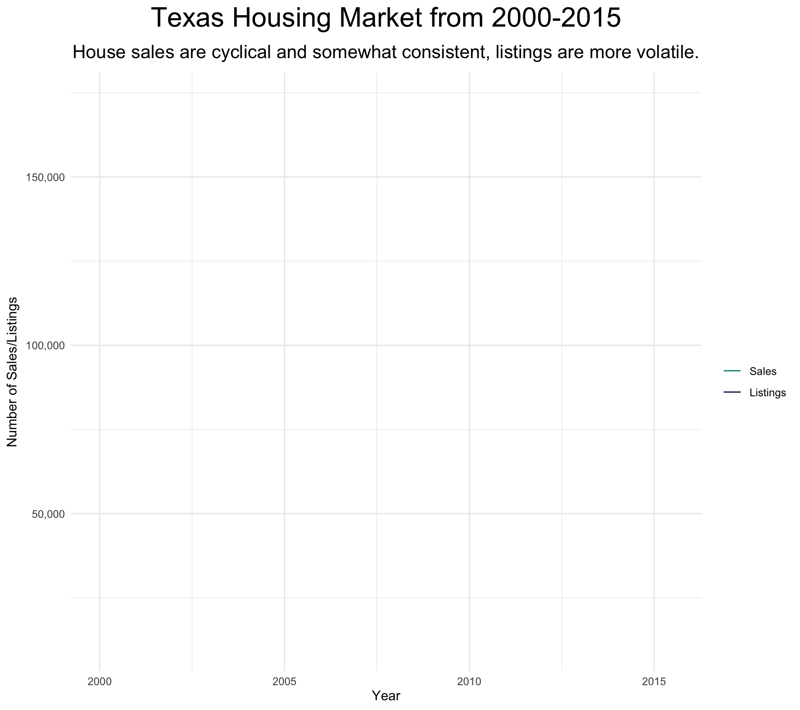

# Animated Line Graphs

For all of the basic animations, we'll use the `txhousing` dataset within the `ggplot2` library, for simplicity. This dataset contains "information about the housing market in Texas provided by the [TAMU real estate center](https://trerc.tamu.edu/)".&#x20;

In a few minutes, we'll make this graph:

<figure><figcaption></figcaption></figure>

To get started, let's load all the libraries we'll need:

```
library(ggplot2) #plotting and getting the txhousing dataset
library(dplyr) #sorting the data to fit our graph
library(gganimate) #animating the ggplot
```

Now that we have the libraries, we can get the dataset. So that we can easily view it, let's put it into a variable.

```
txhousing_data <- txhousing
```

<figure><figcaption><p>The first five row of the txhousing_data dataframe.</p></figcaption></figure>

We want to have a single number for sales and listings for each month and year. Luckily, the dataset already comes with a `date` column that specifies both the month and the year, so we can just group based on `date` and sum the sales and listings (for every city).

```
txhousing_data <- txhousing_data |> 
  group_by(date) |> 
  filter(!is.na(sales)) |> #any NAs make the 'sum' = 0
  filter(!is.na(listings)) |> #any NAs make the 'sum' = 0
  summarise(
    sales = sum(sales),
    listings = sum(listings)
  )
```
