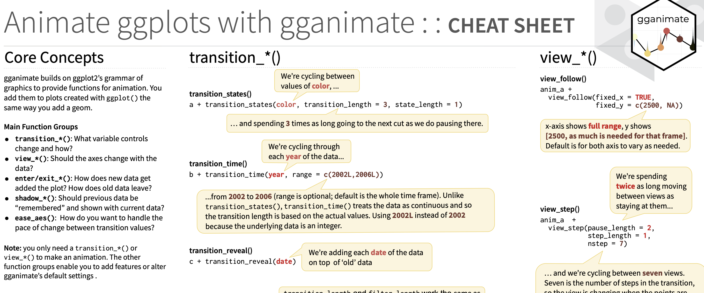

# FAQ

Below are a few resources and code snippets that might help to alleviate errors.

***

If you want to know more about the syntax of the gganimate package, consult this [cheat sheet](https://rstudio.github.io/cheatsheets/gganimate.pdf), which contains detailed information about various parameters and what they mean.

<figure><figcaption></figcaption></figure>

***

If you're having trouble saving your gif (or if its saving to a "tmp" folder), make sure that the "gifski" package is installed and loaded.

```r
install.packages('gifski')
library(gifski)
```

If that still doesn't work, try adding renderer=gifski\_renderer() to your animate function:

```r
animate(animation, renderer=gifski_renderer())
```
